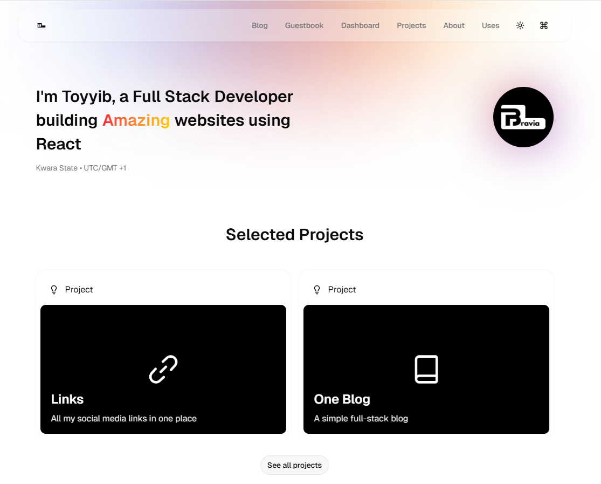
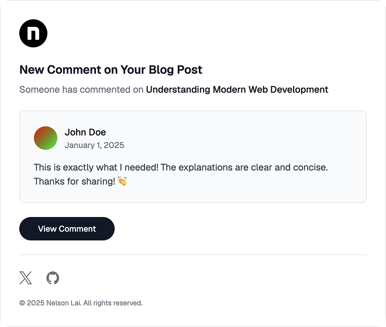
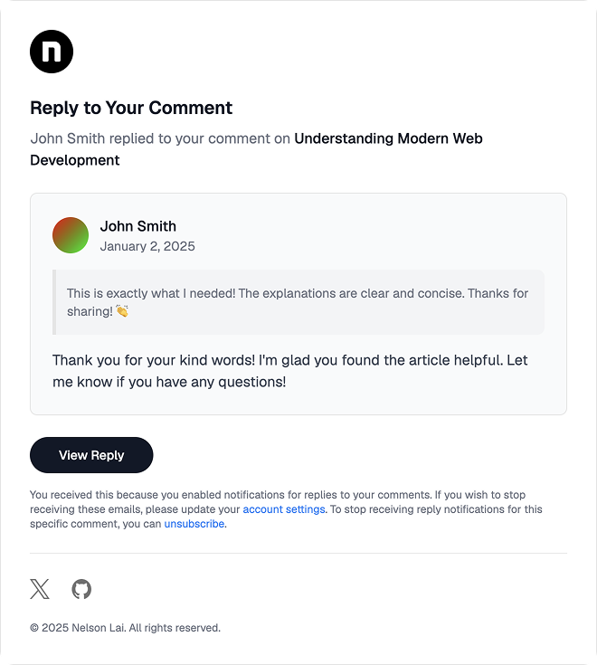

<div align="center">
  <a href="https://braviaprime.com">
    <picture>
      <source media="(prefers-color-scheme: dark)" srcset="public/images/dark-header.png">
      
    </picture>
  </a>

  <br />
  <br />

  <h1>braviaprime.com</h1>

  <p>
    <strong>A high-performance, i18n-native personal engineering platform & research hub.</strong>
  </p>

  <p>
    <a href="https://braviaprime.com">Live Demo</a> •
    <a href="#key-architectural-highlights">Architecture</a> •
    <a href="#getting-started">Getting Started</a> •
    <a href="#academic--engineering-relevance">Ph.D. Context</a>
  </p>

  <!-- Badges -->
  <p>
    
    
    
    
    
    
  </p>
</div>

---

# 📌 Executive Summary

`braviaprime.com` is a full-stack engineering portfolio and technical publishing platform built with **Next.js 16 (App Router & Turbopack)**. Designed with production-grade reliability, internationalization, and deterministic performance in mind, this project serves as both a digital presence and a sandbox for testing modern web infrastructure, distributed caching, and component architectures.

## Academic & Engineering Relevance

- **High-Performance System Design:** Engineered to achieve near-100 Lighthouse scores across Performance, Accessibility, and SEO metrics.
- **Strict Type Safety & Code Quality:** Pure TypeScript implementation with full schema validation (`t3-env`), automated quality gates (`Lefthook`), and unit/E2E test suites (`Vitest`, `Playwright`).
- **Global Localization (i18n):** Multi-language routing and message management across English, Spanish, Japanese, Portuguese, and Chinese locales.

---

# 🛠️ Tech Stack & System Architecture

| Domain | Technologies Used |
|----------|----------|
| **Framework & Core** | Next.js 16 (App Router), TypeScript, Bun Runtime |
| **Database & Cache** | Drizzle ORM, PostgreSQL, Redis (Upstash) |
| **API Layer** | oRPC, Next.js Server Actions, t3-env Validation |
| **Content Engine** | MDX, Shiki (Syntax Highlighting), Content Collections |
| **Internationalization** | `next-intl` (Multi-locale Routing) |
| **Auth & Security** | Better Auth, Upstash Rate Limiting |
| **UI & Animation** | Base UI, Tailwind CSS, Motion (Framer Motion) |
| **Testing & CI/CD** | Vitest, Playwright, ESLint, Prettier, Lefthook |

---

# 🚀 Key Features

## 📐 Modular Component Architecture & Design System

- Built on top of accessible primitives (Base UI) paired with custom Tailwind design tokens.
- Light & Dark theme support with automatic system-preference detection.
- Interactive MDX components with live code blocks, image zoom, and dynamic Table of Contents generation.

## 🌐 Distributed Data & Performance Optimization

- **Caching Layer:** Redis caching for dynamic views, comment aggregation, and real-time Spotify API stats.
- **Rate Limiting:** Distributed sliding-window rate limiting via Upstash to protect API routes.
- **Edge SEO:** Dynamic Open Graph image generation (`next/og`), structured JSON-LD schemas, and automated RSS/Sitemap generation.

## 💬 Real-Time Engagement & Admin Suite

- **Interactive Comments & Likes:** Custom-built nested comment system with optimistic UI updates and like counters.
- **Transactional Emails:** Responsive HTML email templates (`React Email`) for reply/comment notifications.
- **System Monitoring:** Integrated Umami analytics for privacy-focused site metrics.

---

## 📧 Email Notifications Preview

<div align="center">
  <table width="100%">
    <tr>
      <td align="center" width="50%">
        <strong>Comment Notification</strong><br/><br/>
        
      </td>
      <td align="center" width="50%">
        <strong>Reply Notification</strong><br/><br/>
        
      </td>
    </tr>
  </table>
</div>

---

# 📁 Repository Structure

```text
braviaprime.com/
├── public/                         # Optimized static assets and design resources
├── src/
│   ├── app/                        # Next.js App Router ([locale] dynamic routing)
│   ├── components/                 # Reusable, accessible UI components
│   ├── constants/                  # Application constants
│   ├── content/                    # Structured MDX content & dynamic collections
│   ├── contexts/                   # React contexts
│   ├── db/                         # PostgreSQL schemas, migrations (Drizzle ORM)
│   ├── emails/                     # React Email templates
│   ├── hooks/                      # Custom React hooks
│   ├── i18n/                       # Routing & translation configuration
│   ├── lib/                        # Utility libraries
│   ├── mdx-plugins/                # Custom Rehype and Remark plugins
│   ├── orpc/                       # Strongly typed API endpoints
│   ├── styles/                     # Global styles
│   ├── tests/                      # Unit (Vitest) & E2E (Playwright) test suites
│   └── utils/                      # Utility functions
├── docker-compose.yml              # Development container orchestration
└── package.json                    # Dependency manifest & script definitions
```

---

# 💻 Local Development & Setup

## Prerequisites

Ensure you have the following installed on your machine:

- **Node.js:** `>= 24.0.0`
- **Bun:** `>= 1.0.0`
- **Docker Engine & Compose**
- **VS Code** (recommended)

## Environment & Startup Sequence

### 1. Clone & Install Dependencies

```bash
git clone https://github.com/braviaprime/braviaprime.com.git
cd braviaprime.com
bun install
```

### 2. Configure Environment Variables

```bash
cp .env.example .env.local
```

### 3. Start Local Database & Cache

```bash
docker compose up -d
```

### 4. Execute Migrations & Seed Data

```bash
bun db:migrate
bun db:seed
```

### 5. Launch Development Servers

```bash
bun dev
# Main Next.js App -> http://localhost:3000

bun email:dev
# React Email Server -> http://localhost:3001
```

## 📊 Local Service Map

| Service | Address | Purpose |
|----------|----------|----------|
| Next.js Frontend | `http://localhost:3000` | Local Web Server |
| React Email | `http://localhost:3001` | Email Template Previewer |
| Cosmos | `http://localhost:3002` | Component Playground |
| PostgreSQL | `localhost:5432` | Relational Database |
| Redis | `localhost:6379` | In-Memory Data Store |
| Redis Serverless | `localhost:8079` | Upstash Emulator |

---

# 🧪 Quality Assurance & Available Scripts

```bash
# Development & Tools
bun dev
bun email:dev
bun cosmos

# Build & Production
bun run build
bun start
bun analyze

# Quality Control & Testing
bun check
bun lint
bun typecheck
bun format
bun knip
bun test:unit
bun test:e2e

# Database Operations
bun db:migrate
bun db:seed
bun db:push
bun db:reset
bun db:studio
```

---

# 🤝 Credits & Acknowledgments

This project stands on the shoulders of the open-source community:

- **Base Blog Template:** Inspired by [Tailwind Next.js Starter Blog](https://github.com/timlrx/tailwind-nextjs-starter-blog).
- **Design Language:** Inspired by [Geist UI Kit](https://www.figma.com/community/file/1266863403759514317/geist-ui-kit-for-figma).
- **Subsystem Architecture:** Comment engine adapted from [fuma-comment](https://github.com/fuma-nama/fuma-comment), Rehype plugins from [fumadocs](https://github.com/fuma-nama/fumadocs), and UI components from [shadcn/ui](https://github.com/shadcn-ui/ui).

---

# 👨‍💻 Author & Research Context

**Olanrewaju Toyyib (Bravíaprime)**

*Software Engineer & Academic Researcher*

- 🌐 **Website:** https://braviaprime.com
- 🐙 **GitHub:** https://github.com/braviaprime
- 🎓 **Academic Target:** Prospective Ph.D. Candidate in Computer Science / Software Engineering at **Technical University of Munich (TUM), Germany**.

---

# 🤝 Sponsorship & Support

If you find this project helpful or relevant to your research, consider sponsoring the repository:

👉 https://github.com/sponsors/braviaprime

---

# 📄 License

Distributed under the MIT License. See the LICENSE file for details.